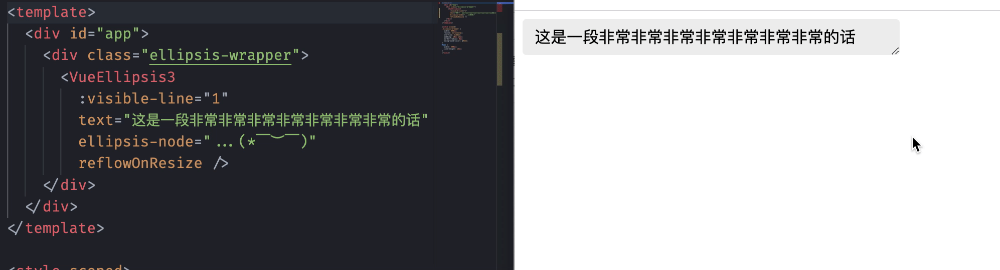

# vue-ellipsis-3

> 一个高性能、可自定义的 vue3 文本缩略组件。

若是你使用 vue 2.x 版本，请移步 [vue-ellipsis-component](https://github.com/ruofee/vue-ellipsis-component)

## Demo



## 安装

推荐使用 npm 或是 yarn 进行组件安装：


```bash
# npm
npm i vue-ellipsis-3
# or yarn
yarn add vue-ellipsis-3
```

## 注册组件

### 全局注册

```js
import VueEllipsis3 from 'vue-ellipsis-3';

app.use(VueEllipsis3);
```

### 在组件中注册

```html
<script>
import { VueEllipsis3 } from 'vue-ellipsis-3';

export default {
  components: {
    VueEllipsis3,
  },
};
</script>
```

## 使用

```html
<template>
  <vue-ellipsis-3 text="这是一段非常非常非常非常非常非常非常非常非常非常非常长的话" />
</template>
```

vue-ellipsis-3 只是在 vue-ellipsis-component 上做迁移，更多示例可以完全参考 [vue-ellipsis-component](https://github.com/ruofee/vue-ellipsis-component)。

## 属性

| 属性名          | 类型                                      | 默认值   | 描述                                                         |
| --------------- | ----------------------------------------- | -------- | ------------------------------------------------------------ |
| text            | string                                    | Required | 需要进行缩略的文本                                           |
| visibleLine     | number                                    | 1        | 文本可见行数；超过该行数时文本会进行裁剪。`visibleLine` 不可大于 `maxLine` |
| visibleHeight   | number                                    |          | 文本可见高度；超过该高度时文本会进行裁剪，优先级高于 `visibleLine`。`visibleHeight` 不可大于 `maxHeight` |
| ellipsis        | boolean                                   | true     | 是否开启缩略                                                 |
| ellipsisNode    | string                                    | ...      | 自定义缩略符                                                 |
| endExcludes     | (string \| RegExp)[]                      | []       | 结尾处希望被过滤掉的字符（在缩略符之前），支持字符串和正则表达式       |
| useInnerHtml    | boolean                                   | false    | 将 `text` 当做 HTML 进行缩略（请确保传递的 text 安全可靠，否则可能导致 XSS 安全问题） |
| reflowOnResize  | boolean                                   |          | 容器大小改变时是否重新布局，原生缩略支持时默认是 true，否则为 false |
| onReflow        | (ellipsis: boolean, text: string) => void |          | 重排完成回调事件。参数 `ellipsis` 表示文本是否被截断；参数 `text` 为可见文本（不包含缩略符） |
| onEllipsisClick | () => void                                |          | 缩略符点击回调事件                                           |

## 插槽

| 名称         | 描述                                                         |
| ------------ | ------------------------------------------------------------ |
| ellipsisNode | 自定义缩略符，优先级高于 `ellipsisNode` 属性，若是同时设置，则以 `slot` 为准 |

## License

MIT

## Develop & Contribution

```bash
# install deps of component
yarn
# start the frontend server
yarn dev
# run unit test
yarn test
```

If you want to contribute your code, send a pull request in github.
